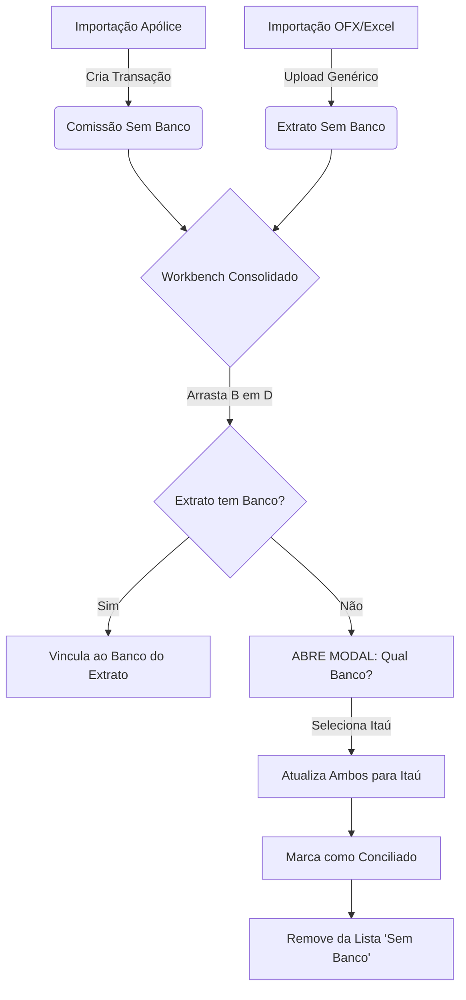

# Fluxograma: Ciclo de Vida da Comissão (Conciliação Automática)

Este documento explica como a comissão nasce, onde ela vive e como ela é conciliada no sistema.

## 1. Importação da Apólice (O Início)
O usuário importa uma planilha de apólices ou cadastra manualmente.
*   **Ação**: Sistema cria uma transação financeira (Receita/Despesa).
*   **Estado Inicial**:
    *   `Status`: **Pendente**.
    *   `Banco`: **NULL (Sem Banco)**.
    *   `Descrição`: "Comissão da apólice X".

---

## 2. O Workbench (A Mesa de Trabalho)
O usuário entra no menu "Extrato & Conciliação" -> Aba "Workbench".

> **Visualização Padrão (Consolidado)**:
> O Workbench abre **sem nenhum banco selecionado**.
> *   **Esquerda**: Extrato (Itens sem banco ou importados via "Nova Importação" sem selecionar banco).
> *   **Direita**: Sistema (Todas as comissões pendentes e sem banco).

**NENHUM MODAL DEVE APARECER AQUI.** O usuário vê tudo o que está "solto".

---

## 3. O Ato de Conciliar (Vínculo)
O usuário identifica uma **Comissão (Sistema)** que corresponde a uma **Entrada (Extrato)**.

### Cenário A: Item do Extrato JÁ TEM Banco (Ex: Santander)
1.  Usuário arrasta a Comissão (Sem Banco) para cima do Item do Extrato (Santander).
2.  **Sistema**: Não pergunta nada.
3.  **Ação**: A comissão assume o banco "Santander" e é conciliada.

### Cenário B: Item do Extrato NÃO TEM Banco (Importação Genérica)
1.  Usuário arrasta a Comissão (Sem Banco) para cima do Item do Extrato (Sem Banco).
2.  **SISTEMA DISPARA MODAL**:
    *   *"Para qual banco você deseja vincular essa transação?"*
3.  Usuário seleciona: **"Itaú"**.
4.  **Ação Final**:
    *   **Extrato**: Atualiza `bank_account_id` para Itaú.
    *   **Comissão**: Atualiza `bank_account_id` para Itaú.
    *   **Status**: Ambos viram `Conciliado`.
    *   **Visão**: Ambos **somem** da lista de "Sem Banco" (pois agora têm banco).

---

## Resumo da Lógica Visual

