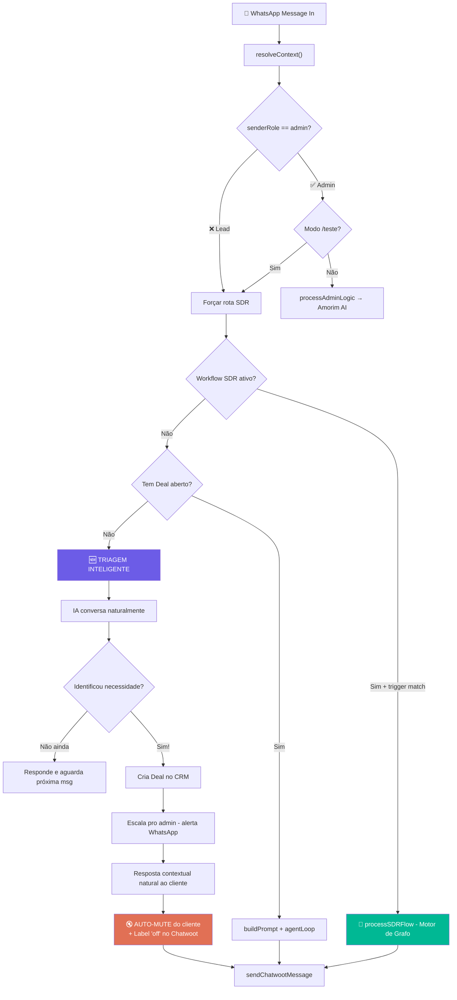
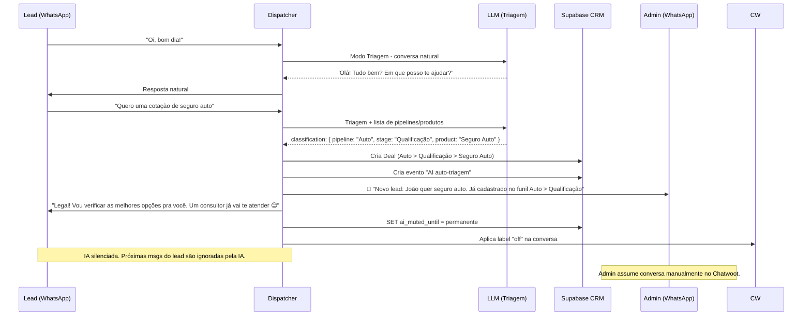
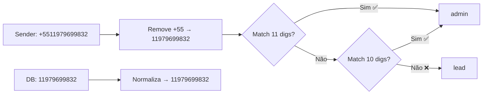
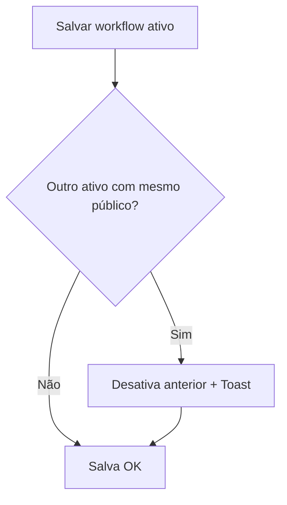

# Design: Arquitetura do Dispatcher Corrigido

## Diagrama de Roteamento Final

## Ciclo de Vida do Lead (Sem Workflow)

## Normalização de Telefone Corrigida

## Roteamento por Cenário

| Quem | Workflow SDR? | Deal? | Resultado |
|---|---|---|---|
| Admin | Irrelevante | Irrelevante | → Amorim AI |
| Admin /teste | Sim | Irrelevante | → processSDRFlow |
| Lead | Sim + match | Irrelevante | → processSDRFlow |
| Lead | Não | Sim | → buildPrompt (stage settings) |
| Lead | Não | Não | → **Triagem** → Deal → Escala → Mute |

## Validação Gatilho Único

